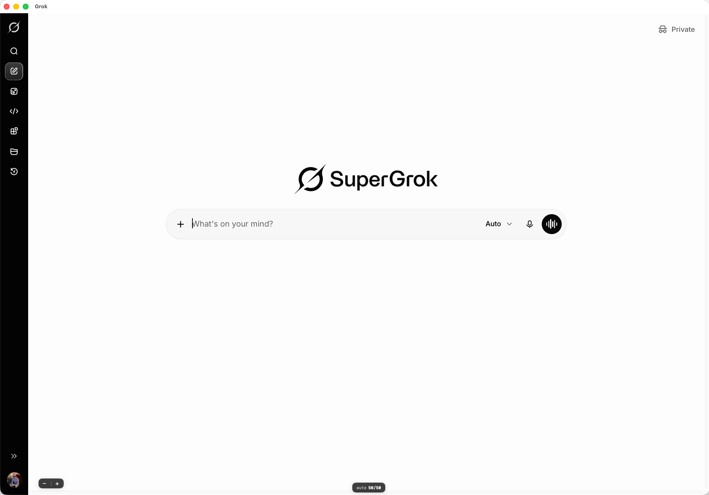

# Grok for macOS

An unofficial native macOS app for [grok.com](https://grok.com) — Grok in its own window, with a global hotkey, instead of living in a browser tab.

> **Disclaimer:** This is an unofficial app and is not affiliated with, endorsed by, or connected to xAI. "Grok" is a trademark of xAI. This app simply wraps the grok.com website.



## Install

1. Download `Grok-x.y.dmg` from the [latest release](https://github.com/nhershy/Grok-macOS/releases/latest).
2. Open the DMG and drag **Grok** into **Applications**.
3. Launch it. That's it — the app is signed and notarized by Apple, so there are no security warnings to click through.

## Features

- **Global hotkey** — press <kbd>⌥ Option</kbd>+<kbd>Space</kbd> anywhere to summon or hide Grok
- **Zoom controls** — on-screen −/+ buttons plus <kbd>⌘−</kbd> / <kbd>⌘=</kbd> / <kbd>⌘0</kbd>, and your zoom level is remembered
- **Feels native** — file uploads and downloads use real macOS panels, downloads are revealed in Finder, and camera/mic work for voice mode
- **Sign-in just works** — including Google sign-in, which normally breaks in embedded web views
- **Stays out of the way** — external links open in your default browser; closing the window keeps Grok running for instant recall
- Sandboxed, hardened runtime, no analytics, no nonsense

## Keyboard shortcuts

| Shortcut | Action |
|---|---|
| <kbd>⌥Space</kbd> | Show/hide Grok (works system-wide) |
| <kbd>⌘N</kbd> | New chat |
| <kbd>⌘R</kbd> | Reload |
| <kbd>⌘[</kbd> / <kbd>⌘]</kbd> | Back / Forward |
| <kbd>⇧⌘H</kbd> | Home |
| <kbd>⌘−</kbd> / <kbd>⌘=</kbd> / <kbd>⌘0</kbd> | Zoom out / in / reset |

## Requirements

- macOS 14 (Sonoma) or later

## Building from source

Requires Xcode 26.6 or later.

```sh
git clone https://github.com/nhershy/Grok-macOS.git
cd Grok-macOS
open Grok-macOS.xcodeproj
```

Set your own development team under **Signing & Capabilities**, then build and run. (The `scripts/` folder also contains the tooling used to generate the app icon and to cut releases — see [RELEASING.md](RELEASING.md).)

## License

[MIT](LICENSE)
